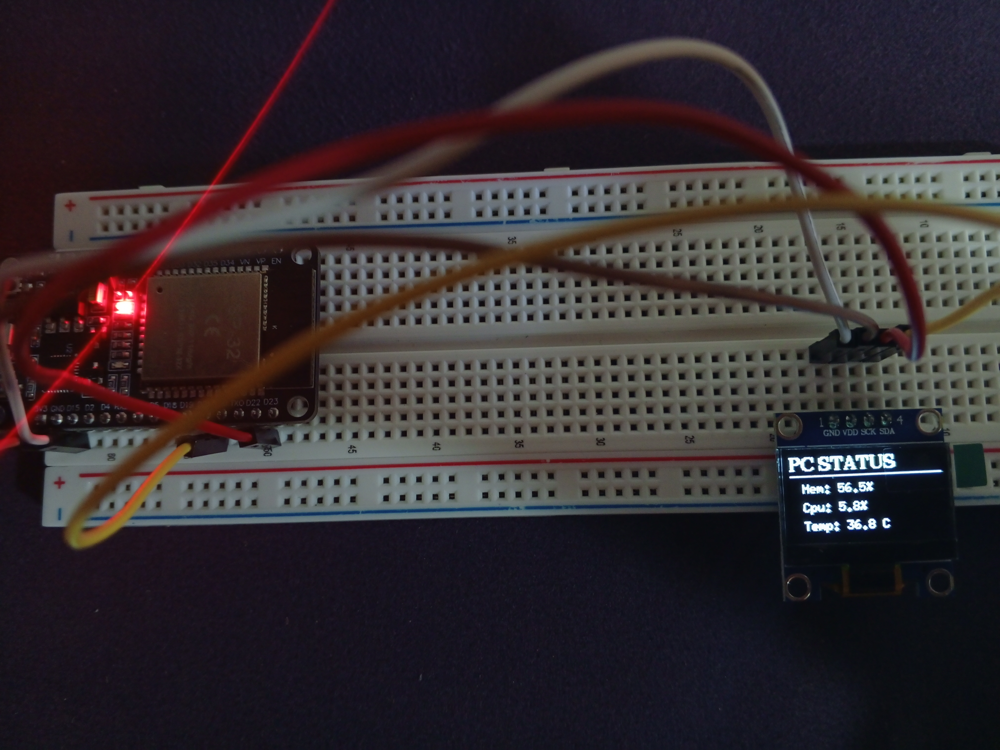

# PC Stats Monitor using ESP32 and Java

 A complete, end-to-end IoT project that displays your PC's real-time hardware statistics (Memory Usage, CPU Usage, CPU Temperature) on a remote OLED screen powered by an ESP32 microcontroller.

This project consists of two main parts:
1.  A lightweight **Java backend** that runs on your PC, gathers hardware stats using the OSHI library, and exposes them via a simple JSON API.
2.  An **Arduino frontend** for the ESP32 that connects to your Wi-Fi, fetches the JSON data from the server, and displays it on a 128x64 OLED screen.

## Features

* **Real-Time Monitoring:** Get instant updates on your PC's key performance metrics.
* **Remote Display:** Place the OLED display anywhere within Wi-Fi range for a convenient, standalone hardware monitor.
* **Lightweight Server:** Uses Java's built-in HTTP server for minimal performance impact on your PC.
* **Clean & Configurable:** Code is separated into a logic file (`main.cpp`) and a configuration file (`config.h`) for easy setup.

## Components & Technologies

* **Backend (Server):**
    * Java (JDK 17)
    * [OSHI](https://github.com/oshi/oshi): A free JNA-based library to get operating system and hardware information.
    * Maven for dependency management.

* **Frontend (Client):**
    * ESP32 Microcontroller
    * Arduino Framework
    * 128x64 I2C OLED Display (SSD1306 / SH1106)
    * [ArduinoJson](https://arduinojson.org/): For parsing JSON data.
    * [U8g2lib](https://github.com/olikraus/u8g2): For controlling the OLED display.

## Setup and Installation

### 1. Backend (Java Server)

1.  Make sure you have Java (JDK 17 or later) and Maven installed.
2.  Open the `Java(Backend)/PC-Stats-Monitor` project in your favorite IDE (like IntelliJ IDEA or VS Code).
3.  Let Maven download the OSHI dependency specified in the `pom.xml` file.
4.  Run the `Main.java` class. The server will start on port 8080.
5.  Check your PC's local IP address (e.g., using `ipconfig` or `ifconfig`). You will need this for the Arduino configuration.
6.  Ensure your PC's firewall allows incoming connections on TCP port 8080 for the Java application.

### 2. Frontend (Arduino Client)

1.  Open the `Arduino` folder in an IDE like PlatformIO (VS Code) or the Arduino IDE.
2.  Install the required libraries: `ArduinoJson` and `U8g2lib`.
3.  Open the `config.h` file.
4.  Fill in your Wi-Fi credentials (`ssid` and `pass`).
5.  Update the `serverURL` with the IP address of your PC from the previous step.
6.  Connect your OLED display to the ESP32 using the default hardware I2C pins (SDA: GPIO 21, SCL: GPIO 22). If you use different pins, you must change the U8g2 constructor in `config.h` to the Software I2C version.
7.  Upload the code to your ESP32. The display should light up and show your PC's stats!

## Future Work (TODO)

* Add GPU temperature and usage monitoring.
